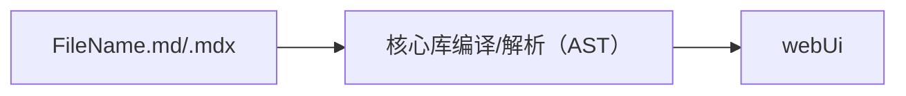
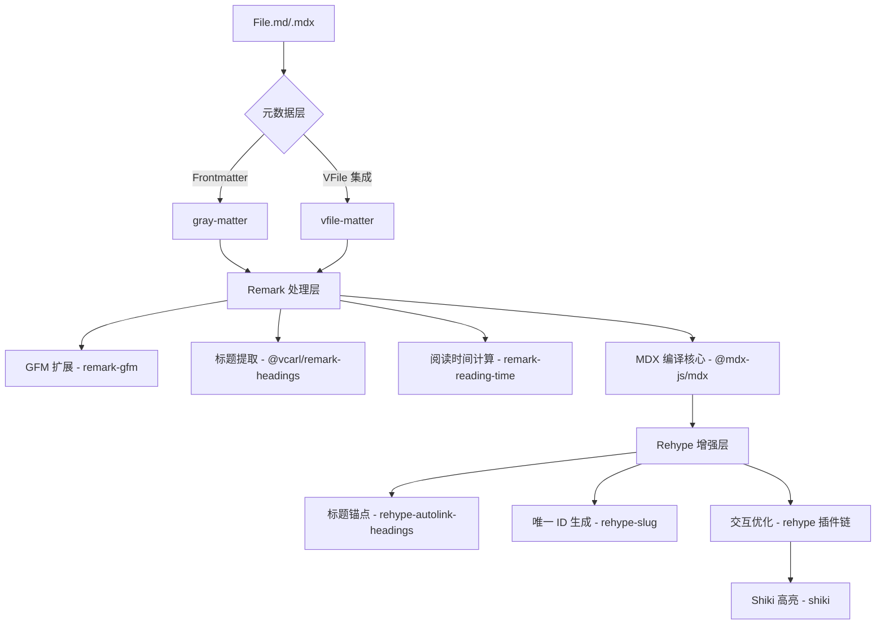

本文主要对 Nodejs.org 官方文档项目中的 MD/MDX 处理流水线相关核心库进行深度分析，旨在揭示其工作原理与协同方式。



### 核心库

| 库名                           | 分类         | 作用                                              | npm 安装命令 & 链接                                                                              |
| ------------------------------ | ------------ | ------------------------------------------------- | ------------------------------------------------------------------------------------------------ |
| **`@mdx-js/mdx`**              | MDX 核心处理 | 将 `.mdx`/`.md` 文件编译为 React 组件代码         | [`npm install @mdx-js/mdx`](https://www.npmjs.com/package/@mdx-js/mdx)                           |
| **`remark-gfm`**               | Remark 插件  | 支持 GitHub Flavored Markdown（表格、任务列表等） | [`npm install remark-gfm`](https://www.npmjs.com/package/remark-gfm)                             |
| **`@vcarl/remark-headings`**   | Remark 插件  | 提取标题生成目录结构                              | [`npm install @vcarl/remark-headings`](https://www.npmjs.com/package/@vcarl/remark-headings)     |
| **`remark-reading-time`**      | Remark 插件  | 计算文档阅读时间                                  | [`npm install remark-reading-time`](https://www.npmjs.com/package/remark-reading-time)           |
| **`rehype-slug`**              | Rehype 插件  | 为标题生成唯一 `id`                               | [`npm install rehype-slug`](https://www.npmjs.com/package/rehype-slug)                           |
| **`rehype-autolink-headings`** | Rehype 插件  | 为标题添加锚点链接                                | [`npm install rehype-autolink-headings`](https://www.npmjs.com/package/rehype-autolink-headings) |
| **`gray-matter`**              | 元数据处理   | 解析 Frontmatter 元数据                           | [`npm install gray-matter`](https://www.npmjs.com/package/gray-matter)                           |
| **`vfile-matter`**             | 元数据处理   | 基于 `vfile` 的 Frontmatter 解析                  | [`npm install vfile-matter`](https://www.npmjs.com/package/vfile-matter)                         |
| **`shiki`**                    | 代码高亮     | 基于 VS Code 的语法高亮                           | [`npm install shiki`](https://www.npmjs.com/package/shiki)                                       |
| **`github-slugger`**           | 辅助工具     | 生成 URL 友好的 slug                              | [`npm install github-slugger`](https://www.npmjs.com/package/github-slugger)                     |
| **`vfile`**                    | 辅助工具     | 虚拟文件操作工具                                  | [`npm install vfile`](https://www.npmjs.com/package/vfile)                                       |

> 安装所有依赖

```bash
npm install @mdx-js/mdx remark-gfm @vcarl/remark-headings remark-reading-time rehype-slug rehype-autolink-headings gray-matter vfile-matter shiki github-slugger vfile
```

## 核心处理流程



### 1. 元数据解析

使用 **`gray-matter`** 或 **`vfile-matter`** 提取文档头部元信息：

```yaml
---
title: 'MDX 指南'
date: 2025-03-20
---
```

### 2. Markdown 增强

通过 Remark 插件链处理内容：

```javascript
import remarkGfm from 'remark-gfm'
import remarkHeadings from '@vcarl/remark-headings'
import remarkReadingTime from 'remark-reading-time'

// 配置示例
const processor = unified().use(remarkGfm).use(remarkHeadings).use(remarkReadingTime)
```

### 3. MDX 编译

通过 **`@mdx-js/mdx`** 转换为 React 组件：

```javascript
import { compile } from '@mdx-js/mdx'

const mdxContent = `# Hello MDX`
const jsxCode = await compile(mdxContent)
```

### 4. HTML 增强

使用 Rehype 插件优化输出：

```javascript
import rehypeSlug from 'rehype-slug'
import rehypeAutolinkHeadings from 'rehype-autolink-headings'

// 标题会变为: <h2 id="section"><a href="#section">#</a>Section</h2>
const processor = unified().use(rehypeSlug).use(rehypeAutolinkHeadings, { behavior: 'append' })
```

### 5. 代码高亮

通过 **`shiki`** 实现专业级高亮：

```javascript
import { getHighlighter } from 'shiki'

const highlighter = await getHighlighter({ theme: 'github-dark' })
const html = highlighter.codeToHtml(`console.log("Hello")`, { lang: 'js' })
```

---

## 总结

通过以上这些库，我们可以构建一个功能强大的 MDX 文档处理流水线：

1. **内容增强**：通过 Remark 插件支持丰富格式
2. **交互优化**：Rehype 插件实现标题锚点
3. **元数据管理**：Frontmatter 解析与传递
4. **开发体验**：代码高亮与自动化工具链
