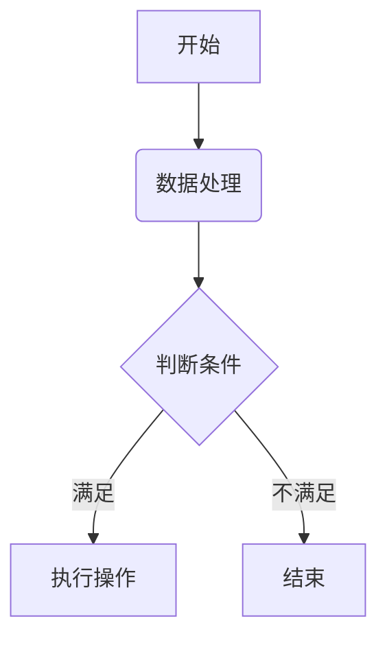

# H1 主标题 😎

## H2 二级标题

### H3 三级标题

#### H4 四级标题

##### H5 五级标题

###### H6 六级标题

## 增强功能（需 MDX 支持）

```mermaid
graph TD
A[开始] --> B(数据处理)
B --> C{判断条件}
C -->|满足| D[执行操作]
C -->|不满足| E[结束]
```

## 响应式布局（纯 CSS 实现）

    
响应区块1

    
响应区块2

    
响应区块3

