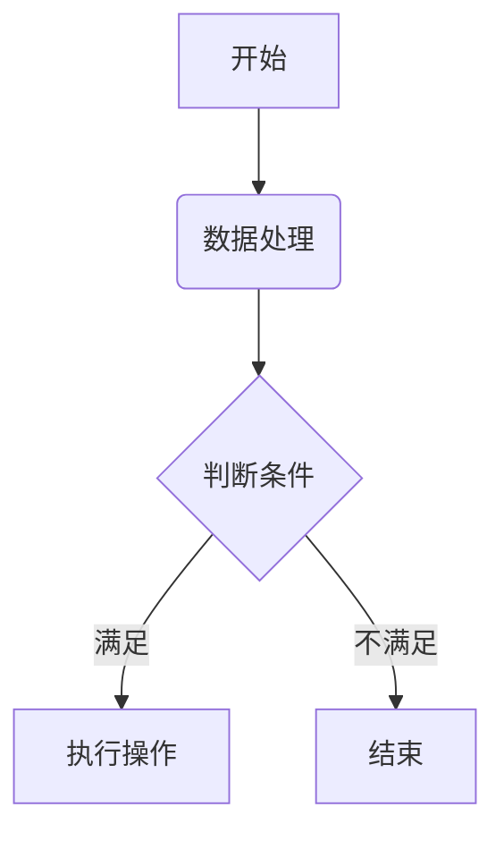

# 主要功能演示

## 特色项目推荐

**优质开源项目推荐**

-   **[pica](https://nodeca.github.io/pica/demo/)** - 浏览器端高质量快速图片缩放库
-   **[babelfish](https://github.com/nodeca/babelfish/)** - 开发者友好国际化方案，支持复数形式与简洁语法

---

# 标题系统

# H1 主标题 😎

## H2 二级标题

### H3 三级标题

#### H4 四级标题

##### H5 五级标题

###### H6 六级标题

## 分隔线样式

---

---

---

## 智能符号替换

（启用排版优化后可见效果）

(c) © (r) ® (tm) ™ (p) ℗ +-

测试.. 测试... 测试..... 测试?..... 测试!....

!!!!!! ???? ,, -- ---

"智能引号转换" 与 '单引号处理'

## 文本强调

**加粗文本**
**另一种加粗方式**

_斜体文本_
_另一种斜体形式_

~~删除线效果~~

## 引用嵌套

> 一级引用文本
>
> > 二级嵌套引用
> >
> > > 三级嵌套引用（含空格分隔）

## 列表系统

### 无序列表

-   列表项使用 `+`, `-` 或 `*` 开头
-   子列表通过缩进实现：
    -   符号变更强制新列表开始：
        -   自由排版项
        *   混合符号示例
        -   最后一项
-   简单易用！

### 有序列表

1. 第一列表项
2. 第二列表项
3. 第三列表项

### 特殊编号

1. 使用连续数字...
1. ...或保持所有编号为 1

偏移编号示例： 57. 特殊起始

1. 自动延续

## 代码系统

### 行内代码

`console.log('Hello World')`

### 缩进代码

    // 注释示例
    function example() {
      return 'indented code';
    }

### 围栏代码块

````

通用代码块示例


### 语法高亮
```js
var fibonacci = function(n) {
  if (n < 2) return n;
  return fibonacci(n - 1) + fibonacci(n - 2);
};
````

## 表格系统

### 基础表格

| 选项   | 描述                        |
| ------ | --------------------------- |
| data   | 数据文件路径                |
| engine | 模板引擎（默认 Handlebars） |
| ext    | 输出文件扩展名              |

### 右对齐表格

|   选项 |         描述 |
| -----: | -----------: |
|   data | 数据文件路径 |
| engine |     模板引擎 |
|    ext |   文件扩展名 |

## 链接系统

[普通链接](http://example.com)
[带标题链接](http://example.com '悬浮提示文本')
自动转换链接 https://example.com

## 图片系统


引用式图片：
![替代文本][id]

[id]: https://octodex.github.com/images/dojocat.jpg '道场猫'

## 扩展功能

### 表情符号

> 传统语法：😉 😢 😆 😋
>
> 快捷方式：:-) :-( 8-) ;)

### 上下标

-   19^th^ 上标示例
-   H~2~O 下标示例

### 插入文本

++新增内容标记++

### 高亮文本

==重点突出内容==

### 脚注系统

首条脚注引用[^1]，第二条脚注[^2]。

行内脚注^[直接定义内容]示例。

[^1]: 支持**Markdown 格式**的多段落脚注

    第二段落内容

[^2]: 可重复引用的脚注

### 定义列表

术语 1
: 定义内容 1
延续段落

_带格式术语_
: 定义内容 2

        { 代码块示例 }

    第三段落

紧凑样式：
术语 A
~ 定义 A
术语 B
~ 定义 B1
~ 定义 B2

### 缩写词

HTML 规范示例（自动转换保留部分词）

\*[HTML]: 超文本标记语言

### 自定义容器

::: warning
_此处需要特别注意_
:::

::: tip
操作小贴士：建议先阅读使用文档
:::

## 增强功能（需 MDX 支持）



## 响应式布局（纯 CSS 实现）

<div
    style='
    display: grid;
    grid-template-columns: repeat(1, 1fr);
    gap: 1rem;
    margin-top: 1rem;
    @media (min-width: 768px) {
        grid-template-columns: repeat(3, 1fr);
    }
'
>
    <div style='padding: 1rem; background-color: #eff6ff'>响应区块1</div>
    <div style='padding: 1rem; background-color: #ecfdf5'>响应区块2</div>
    <div style='padding: 1rem; background-color: #fefce8'>响应区块3</div>
</div>

## 文档信息

| 版本 | 更新日期   | 修订说明       |
| ---- | ---------- | -------------- |
| 1.0  | 2025-03-15 | 初始版本发布   |
| 1.1  | 2025-03-20 | 新增交互式组件 |

# 数学公式

## 行内公式

相对论质能方程：\( E = mc^2 \)

## 块级公式

傅里叶变换公式：
\[
\mathcal{F}\{f(x)\} = \hat{f}(\xi) = \int\_{-\infty}^{\infty} f(x)e^{-2\pi i \xi x} dx
\]

多重积分演示：

$$
\iiint_V (\nabla \cdot \mathbf{F}) \, dV = \oiint_S (\mathbf{F} \cdot \mathbf{n}) \, dS
$$
